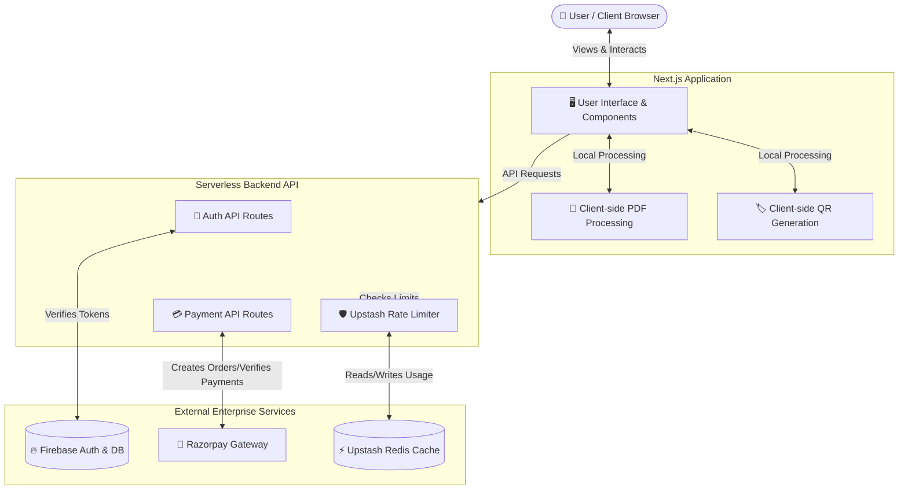

<div align="center">
  <a href="https://utool.in">
    <!-- Replace with your actual logo URL -->
    
  </a>

  <h3 align="center">Utool - Enterprise Utility Platform</h3>

  <p align="center">
    A robust, scalable platform offering powerful PDF manipulation, dynamic QR code generation, and high-performance digital tools.
    <br />
    <a href="https://utool.in"><strong>Explore the platform »</strong></a>
    <br />
    <br />
    <a href="https://utool.in">Live Demo</a>
    ·
    <a href="https://github.com/yourusername/utool/issues">Report Bug</a>
    ·
    <a href="https://github.com/yourusername/utool/issues">Request Feature</a>
  </p>
</div>

<details>
  <summary>Table of Contents</summary>
  <ol>
    <li><a href="#-about-the-project">About The Project</a></li>
    <li><a href="#-key-features">Key Features</a></li>
    <li><a href="#-tech-stack">Tech Stack</a></li>
    <li><a href="#-getting-started">Getting Started</a></li>
    <li><a href="#-project-structure">Project Structure</a></li>
    <li><a href="#-contributing">Contributing</a></li>
    <li><a href="#-license">License</a></li>
    <li><a href="#-contact">Contact</a></li>
  </ol>
</details>

<!-- ABOUT THE PROJECT -->
## 🌟 About The Project

[**Utool.in**](https://utool.in) is an enterprise-grade suite of digital utilities tailored for professionals, creators, and businesses. Engineered from the ground up for speed, security, and scalability, Utool empowers users with a seamless experience across a variety of robust tools—all from a single dashboard. 

Whether processing sensitive PDF documents, generating customized marketing QR codes, or managing secure billing subscriptions, Utool is built to handle intensive workloads reliably.

---

## ✨ Key Features

* **📄 Advanced PDF Manipulation:** Merge, split, edit, and optimize PDFs seamlessly in the browser. Powered by `pdf-lib` to ensure high fidelity and fast processing.
* **🏷️ Dynamic QR Code Generation:** Create customized, high-quality, and scalable QR codes on the fly for marketing campaigns and quick access.
* **🔐 Enterprise Security & Auth:** Robust user sessions and access control powered by Firebase Authentication and Firebase Admin.
* **💳 Frictionless Payments:** Fully integrated with Razorpay for secure, compliant, and seamless payment processing.
* **🛡️ Intelligent Rate Limiting:** Global rate limiting backed by Upstash Redis to prevent abuse, secure endpoints, and guarantee high availability.
* **🎨 Stunning UI/UX:** A beautiful, responsive, and highly accessible interface utilizing Tailwind CSS, Framer Motion for micro-animations, and Sonner for toast notifications.

---

## 🏗️ Tech Stack

This project leverages modern, industry-standard web technologies to ensure optimal performance and developer experience:

* [![Next][Next.js]][Next-url]
* [![React][React.js]][React-url]
* [![Tailwind][Tailwind CSS]][Tailwind-url]
* [![Firebase][Firebase]][Firebase-url]
* [![Upstash][Upstash]][Upstash-url]
* [![Razorpay][Razorpay]][Razorpay-url]
* [![Framer Motion][Framer Motion]][Framer-url]

---

## 🏗️ Architecture & Workflow

Understanding how Utool works is simple! We use a modern, serverless architecture to ensure the platform is fast, secure, and reliable. 

Here is a high-level overview of how different parts of the system interact:

### System Architecture Flow



### 🔍 How It Works (End-to-End)

1. **User Access & Processing:** 
   When you visit [Utool.in](https://utool.in), the **Next.js Frontend** serves the user interface. Tools like PDF merging or QR code generation happen *directly inside your browser* for maximum privacy and speed (no sensitive files are uploaded to our servers!).
   
2. **Authentication (Firebase):**
   When you log in or sign up, your credentials are securely handled by **Firebase Authentication**. The Next.js backend uses Firebase Admin to verify your session tokens so you can access premium features.

3. **Security & Rate Limiting (Upstash):**
   Before any API request (like trying to generate an invoice or access a paid tool) is processed, it passes through our **Upstash Rate Limiter**. This checks a lightning-fast Redis database to make sure no one is abusing the system or making too many requests at once.

4. **Payments & Subscriptions (Razorpay):**
   If you upgrade your plan or purchase a service, the backend securely communicates with **Razorpay** to generate a payment order. Once you pay securely on Razorpay's checkout, Razorpay sends a confirmation back to our server, and we instantly unlock your premium tools.

---

<!-- GETTING STARTED -->
## 🚀 Getting Started

To get a local copy up and running, follow these simple steps.

### Prerequisites

* Node.js (v18.x or later recommended)
* npm, yarn, pnpm, or bun

```bash
npm install npm@latest -g
```

### Local Setup

1. **Clone the repository**
   ```bash
   git clone https://github.com/yourusername/utool.git
   ```
2. **Navigate to the project directory**
   ```bash
   cd utool
   ```
3. **Install dependencies**
   ```bash
   npm install
   ```
4. **Environment Variables**
   Copy the example environment file and populate it with your specific service keys (Firebase, Razorpay, Upstash Redis):
   ```bash
   cp .env.example .env
   ```
5. **Start the development server**
   ```bash
   npm run dev
   ```
6. Open [http://localhost:3000](http://localhost:3000) to view the application in your browser.

---

## 📁 Project Structure

```text
utool/
├── public/              # Static assets (images, fonts, icons)
├── src/
│   ├── app/             # Next.js App Router (Pages, API routes, Layouts)
│   ├── components/      # Reusable React components (UI library, shared elements)
│   ├── lib/             # Core utilities, API clients, and service configurations
│   └── styles/          # Global stylesheets and Tailwind configurations
├── .env.example         # Template for required environment variables
├── package.json         # Project dependencies and NPM scripts
└── eslint.config.mjs    # ESLint configuration
```

---

## 🤝 Contributing

Contributions are what make the open-source community such an amazing place to learn, inspire, and create. Any contributions you make are **greatly appreciated**.

1. Fork the Project
2. Create your Feature Branch (`git checkout -b feature/AmazingFeature`)
3. Commit your Changes (`git commit -m 'Add some AmazingFeature'`)
4. Push to the Branch (`git push origin feature/AmazingFeature`)
5. Open a Pull Request

---

## 🛡️ License

Distributed under the MIT License. See `LICENSE` for more information.

---

## 📧 Contact

**Website:** [https://utool.in](https://utool.in)

<!-- MARKDOWN LINKS & IMAGES -->
[Next.js]: https://img.shields.io/badge/next.js-000000?style=for-the-badge&logo=nextdotjs&logoColor=white
[Next-url]: https://nextjs.org/
[React.js]: https://img.shields.io/badge/React-20232A?style=for-the-badge&logo=react&logoColor=61DAFB
[React-url]: https://reactjs.org/
[Tailwind CSS]: https://img.shields.io/badge/tailwindcss-%2338B2AC.svg?style=for-the-badge&logo=tailwind-css&logoColor=white
[Tailwind-url]: https://tailwindcss.com/
[Firebase]: https://img.shields.io/badge/firebase-ffca28?style=for-the-badge&logo=firebase&logoColor=black
[Firebase-url]: https://firebase.google.com/
[Upstash]: https://img.shields.io/badge/Upstash-00E9A3?style=for-the-badge&logo=upstash&logoColor=black
[Upstash-url]: https://upstash.com/
[Razorpay]: https://img.shields.io/badge/Razorpay-02042B?style=for-the-badge&logo=razorpay&logoColor=3395FF
[Razorpay-url]: https://razorpay.com/
[Framer Motion]: https://img.shields.io/badge/Framer_Motion-black?style=for-the-badge&logo=framer&logoColor=blue
[Framer-url]: https://www.framer.com/motion/
